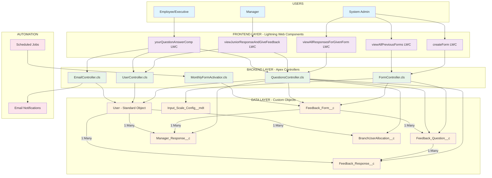

# EvalHub System Architecture & Documentation
**Complete System Analysis for Presentation**

---

## 📊 **SYSTEM OVERVIEW**

**EvalHub** is a comprehensive Salesforce-based employee feedback management system designed for monthly departmental feedback collection, review, and management across organizational hierarchies.

### **Core Business Process Flow**
1. **Form Creation** → Admin creates monthly feedback forms per department
2. **Auto-Activation** → Scheduled job activates forms monthly
3. **Employee Submission** → Employees submit feedback responses
4. **Manager Review** → Managers review and respond to employee feedback
5. **Administrative Oversight** → System-wide reporting and analytics

---

## 🗃️ **COMPLETE DATA MODEL ANALYSIS**

### **1. FEEDBACK_FORM__c** (Custom Object)
**Purpose:** Monthly feedback forms created by administrators

| Field Name | Type | Description | Business Rules |
|------------|------|-------------|----------------|
| `Title__c` | Text | Auto-generated title (e.g., "Sales Feedback January 2025") | Required, Max 255 chars |
| `department__c` | Picklist | Department selection (Sales, Marketing, Technical) | Required |
| `Active_Flag__c` | Checkbox | Controls form availability to users | Only ONE active per department |
| `Applicable_Month__c` | Date | Target month for feedback collection | Required, Used for auto-activation |

**Relationships:**
- One-to-Many with `Feedback_Question__c`
- One-to-Many with `Manager_Response__c`

**Business Logic:**
- Only ONE active form per department at any time
- Auto-activation through scheduled Apex class
- Forms are department-specific

---

### **2. FEEDBACK_QUESTION__c** (Custom Object)
**Purpose:** Individual questions within feedback forms

| Field Name | Type | Description | Business Rules |
|------------|------|-------------|----------------|
| `Feedback_Form__c` | Lookup to Feedback_Form__c | Parent form relationship | Required |
| `Question_Text__c` | Long Text Area | The actual question content | Required, Max 255 chars |
| `Input_Type__c` | Picklist | Question type (Text, Rating, Emoji, Picklist, Slider) | Required |
| `Picklist_Values__c` | Text | Configuration values for non-text questions | Conditional based on Input_Type |

**Relationships:**
- Many-to-One with `Feedback_Form__c`
- One-to-Many with `Feedback_Response__c`

**Question Types Supported:**
- **Text Input** - Free text responses
- **Rating** - Star-based rating (1-5) with configurable icons
- **Emoji** - Emoji-based sentiment scale
- **Picklist** - Pre-defined dropdown options
- **Slider** - Numeric scale (1-10)

---

### **3. FEEDBACK_RESPONSE__c** (Custom Object)
**Purpose:** Employee responses to feedback questions

| Field Name | Type | Description | Business Rules |
|------------|------|-------------|----------------|
| `Question_Lookup__c` | Lookup to Feedback_Question__c | Links to specific question | Required |
| `Rating_Answer__c` | Text | Stores the response value | Required, Max 500 chars |
| `Responder__c` | Lookup to User | Who submitted the response | Required |
| `Respondent__c` | Lookup to User | Who the response is about | Required (same as Responder for self-feedback) |

**Relationships:**
- Many-to-One with `Feedback_Question__c`
- Many-to-One with `User` (Responder)
- Many-to-One with `User` (Respondent)

**Data Integrity:**
- Prevents duplicate responses per user per question
- Stores all response types as text for flexibility
- Special encoding for emoji/rating responses

---

### **4. MANAGER_RESPONSE__c** (Custom Object)
**Purpose:** Manager feedback to employee submissions

| Field Name | Type | Description | Business Rules |
|------------|------|-------------|----------------|
| `Feedback_Form_Lookup__c` | Lookup to Feedback_Form__c | Links to the feedback form | Required |
| `User_Lookup__c` | Lookup to User | The employee being reviewed | Required |
| `Manager_Response_Test__c` | Long Text Area (500 chars) | Manager's written feedback | Required |

**Relationships:**
- Many-to-One with `Feedback_Form__c`
- Many-to-One with `User`

**Business Rules:**
- One manager response per employee per form
- Manager can only respond to direct subordinates
- Responses tied to specific form cycles

---

### **5. INPUT_SCALE_CONFIG__mdt** (Custom Metadata Type)
**Purpose:** Configuration for dynamic input types and scale options

| Field Name | Type | Description | Business Rules |
|------------|------|-------------|----------------|
| `Input_Type__c` | Text | Type of input (rating, emoji, picklist) | Required |
| `Scale_Group__c` | Text | Group classification | Required |
| `Display_Label__c` | Text | What users see (⭐, 😄, High, Energized) | Required |
| `Value_Stored__c` | Text | Value stored in database | Required |
| `Order__c` | Number | Display order within group | Optional |
| `Active__c` | Checkbox | Whether configuration is active | Required |

**Scale Groups:**
- **Star_Config** - Rating star configurations
- **Satisfaction_Emojis** - Emoji sentiment scales
- **Levels** - High/Medium/Low options
- **Work_Energy** - Energized/Neutral/Drained options

---

### **6. BRANCHUSER ALLOCATION__c** (Custom Object) *[Referenced but not defined]*
**Purpose:** Branch allocation for CBO users (geographic hierarchy)

| Field Name | Type | Description | Business Rules |
|------------|------|-------------|----------------|
| `User__c` | Lookup to User | User assigned to branch | Required |
| `Branch__c` | Lookup to Branch__c | Branch assignment | Required |

**Relationships:**
- Many-to-One with `User`
- Many-to-One with `Branch__c`

**Note:** This object is referenced in QuestionsController but not currently defined in the project structure.

---

### **7. BRANCH__c** (Custom Object) *[Referenced but not defined]*
**Purpose:** Geographic branch hierarchy

| Field Name | Type | Description | Business Rules |
|------------|------|-------------|----------------|
| `Name` | Text | Branch name | Required |
| `Region__c` | Text | Geographic region | Required |
| `Cluster__c` | Text | Cluster within region | Required |

**Relationships:**
- One-to-Many with `BranchUserAllocation__c`

---

## 🏗️ **SYSTEM ARCHITECTURE COMPONENTS**

### **Backend Layer (Apex Controllers)**

#### **1. FormController.cls**
**Purpose:** Form management operations for administrators
- `createForm()` - Creates forms with questions
- `getAllForms()` - Retrieves forms for admin view
- `getFilteredForms()` - Advanced form filtering
- `getQuestions()` - Retrieves questions for specific form
- `getInputTypesFromMetadata()` - Loads question type configurations

#### **2. QuestionsController.cls**
**Purpose:** Core business logic for feedback operations
- `getFeedbackData()` - Employee feedback interface data
- `submitFeedback()` - Process employee responses
- `getEmployeeResponseForManager()` - Manager review interface
- `submitManagerResponse()` - Process manager feedback
- `getAllUserResponsesForAdmin()` - Admin reporting data

#### **3. UserController.cls**
**Purpose:** User management and hierarchy operations
- `getCurrentUser()` - Current user context
- `getUsersUnderCurrentUser()` - Direct subordinates
- `getAllUsers()` - All users for admin

#### **4. EmailController.cls**
**Purpose:** Email notification system
- `sendEmailOnFeedbackSubmit()` - Sends notifications after submission
- Employee confirmation emails
- Manager notification emails

#### **5. MonthlyFormActivatior.cls**
**Purpose:** Scheduled automation
- Monthly form activation (1st of each month)
- Previous form deactivation
- Ensures one active form per department

---

### **Frontend Layer (Lightning Web Components)**

#### **Admin Components**
- **createForm** - Dynamic form builder interface
- **viewAllPreviousForms** - Form management dashboard
- **viewAllResponsesForGivenForm** - Comprehensive reporting

#### **Manager Components**
- **viewJuniorResponseAndGiveFeedback** - Team management dashboard
- **viewAllExecutiveUnderManager** - Employee response reviews

#### **Employee Components**
- **yourQuestionAnswerComp** - Feedback submission and viewing

---

## 🔄 **SYSTEM ARCHITECTURE DIAGRAM**



---

## 🔄 **DATA FLOW ARCHITECTURE**

### **1. Form Creation Flow**
```
Admin → createForm LWC → FormController → Feedback_Form__c + Feedback_Question__c
```

### **2. Employee Submission Flow**
```
Employee → yourQuestionAnswerComp → QuestionsController → Feedback_Response__c → EmailController
```

### **3. Manager Review Flow**
```
Manager → viewJuniorResponseAndGiveFeedback → QuestionsController → Manager_Response__c
```

### **4. Automated Activation Flow**
```
Scheduled Job → MonthlyFormActivatior → Feedback_Form__c (Active_Flag__c updates)
```

---

## 🔐 **SECURITY & ACCESS CONTROL**

### **Custom Profiles**
1. **Executive Profile** - Employee feedback submission
2. **Manager Profile** - Team review and response
3. **System Administrator** - Full system access

### **Permission Sets**
- **Executive Permission Set** - Custom object and Apex access

### **Data Security**
- **Role Hierarchy** - Manager-subordinate relationships
- **Department-based Access** - Users see only their department's forms
- **With Sharing** classes for data security
- **Field-level Security** enforcement

---

## 📊 **BUSINESS RULES & CONSTRAINTS**

### **Form Management**
- Only ONE active form per department
- Auto-activation on 1st of each month
- Forms are department-specific

### **Response Management**
- One response per user per question
- Manager can only review direct subordinates
- 500 character limit on text responses
- Email notifications on submission

### **Data Integrity**
- Duplicate prevention mechanisms
- Required field validation
- User permission validation

---

## 🚀 **TECHNICAL SPECIFICATIONS**

### **Platform Details**
- **Salesforce API Version:** 64.0
- **Framework:** Lightning Web Components + Apex
- **Authentication:** Salesforce Security Model
- **Deployment:** Salesforce DX Project Structure

### **Performance Optimizations**
- Cacheable Apex methods for read operations
- Bulk DML operations for data manipulation
- Lazy loading in Lightning components
- Efficient SOQL queries with selective fields

### **Integration Points**
- Email notification system
- Scheduled automation jobs
- Custom metadata type configurations
- Branch allocation system (for geographic hierarchy)

---

**Document Version:** 1.0  
**Last Updated:** January 2025  
**Prepared for:** System Architecture Presentation  
**Project:** EvalHub Employee Feedback Management System 