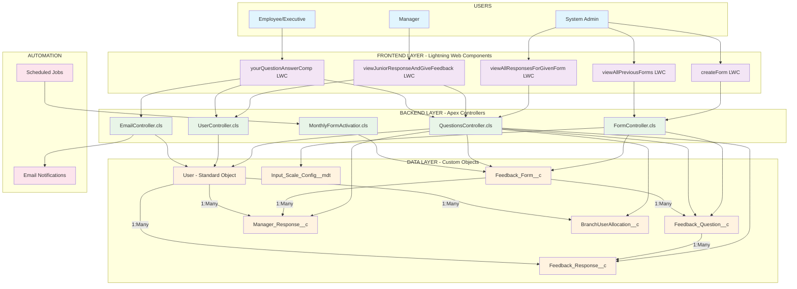

# EvalHub System Architecture & Documentation
**Complete System Analysis for Presentation**

---

## 📊 **SYSTEM OVERVIEW**

**EvalHub** is a comprehensive Salesforce-based employee feedback management system designed for monthly departmental feedback collection, review, and management across organizational hierarchies.

### **Core Business Process Flow**
1. **Form Creation** → Admin creates monthly feedback forms per department
2. **Auto-Activation** → Scheduled job activates forms monthly
3. **Employee Submission** → Employees submit feedback responses
4. **Manager Review** → Managers review and respond to employee feedback
5. **Administrative Oversight** → System-wide reporting and analytics

---

## 🗃️ **COMPLETE DATA MODEL ANALYSIS**

### **1. FEEDBACK_FORM__c** (Custom Object)
**Purpose:** Monthly feedback forms created by administrators

| Field Name | Type | Description | Business Rules |
|------------|------|-------------|----------------|
| `Title__c` | Text | Auto-generated title (e.g., "Sales Feedback January 2025") | Required, Max 255 chars |
| `department__c` | Picklist | Department selection (Sales, Marketing, Technical) | Required |
| `Active_Flag__c` | Checkbox | Controls form availability to users | Only ONE active per department |
| `Applicable_Month__c` | Date | Target month for feedback collection | Required, Used for auto-activation |

**Relationships:**
- One-to-Many with `Feedback_Question__c`
- One-to-Many with `Manager_Response__c`

**Business Logic:**
- Only ONE active form per department at any time
- Auto-activation through scheduled Apex class
- Forms are department-specific

---

### **2. FEEDBACK_QUESTION__c** (Custom Object)
**Purpose:** Individual questions within feedback forms

| Field Name | Type | Description | Business Rules |
|------------|------|-------------|----------------|
| `Feedback_Form__c` | Lookup to Feedback_Form__c | Parent form relationship | Required |
| `Question_Text__c` | Long Text Area | The actual question content | Required, Max 255 chars |
| `Input_Type__c` | Picklist | Question type (Text, Rating, Emoji, Picklist, Slider) | Required |
| `Picklist_Values__c` | Text | Configuration values for non-text questions | Conditional based on Input_Type |

**Relationships:**
- Many-to-One with `Feedback_Form__c`
- One-to-Many with `Feedback_Response__c`

**Question Types Supported:**
- **Text Input** - Free text responses
- **Rating** - Star-based rating (1-5) with configurable icons
- **Emoji** - Emoji-based sentiment scale
- **Picklist** - Pre-defined dropdown options
- **Slider** - Numeric scale (1-10)

---

### **3. FEEDBACK_RESPONSE__c** (Custom Object)
**Purpose:** Employee responses to feedback questions

| Field Name | Type | Description | Business Rules |
|------------|------|-------------|----------------|
| `Question_Lookup__c` | Lookup to Feedback_Question__c | Links to specific question | Required |
| `Rating_Answer__c` | Text | Stores the response value | Required, Max 500 chars |
| `Responder__c` | Lookup to User | Who submitted the response | Required |
| `Respondent__c` | Lookup to User | Who the response is about | Required (same as Responder for self-feedback) |

**Relationships:**
- Many-to-One with `Feedback_Question__c`
- Many-to-One with `User` (Responder)
- Many-to-One with `User` (Respondent)

**Data Integrity:**
- Prevents duplicate responses per user per question
- Stores all response types as text for flexibility
- Special encoding for emoji/rating responses

---

### **4. MANAGER_RESPONSE__c** (Custom Object)
**Purpose:** Manager feedback to employee submissions

| Field Name | Type | Description | Business Rules |
|------------|------|-------------|----------------|
| `Feedback_Form_Lookup__c` | Lookup to Feedback_Form__c | Links to the feedback form | Required |
| `User_Lookup__c` | Lookup to User | The employee being reviewed | Required |
| `Manager_Response_Test__c` | Long Text Area (500 chars) | Manager's written feedback | Required |

**Relationships:**
- Many-to-One with `Feedback_Form__c`
- Many-to-One with `User`

**Business Rules:**
- One manager response per employee per form
- Manager can only respond to direct subordinates
- Responses tied to specific form cycles

---

### **5. INPUT_SCALE_CONFIG__mdt** (Custom Metadata Type)
**Purpose:** Configuration for dynamic input types and scale options

| Field Name | Type | Description | Business Rules |
|------------|------|-------------|----------------|
| `Input_Type__c` | Text | Type of input (rating, emoji, picklist) | Required |
| `Scale_Group__c` | Text | Group classification | Required |
| `Display_Label__c` | Text | What users see (⭐, 😄, High, Energized) | Required |
| `Value_Stored__c` | Text | Value stored in database | Required |
| `Order__c` | Number | Display order within group | Optional |
| `Active__c` | Checkbox | Whether configuration is active | Required |

**Scale Groups:**
- **Star_Config** - Rating star configurations
- **Satisfaction_Emojis** - Emoji sentiment scales
- **Levels** - High/Medium/Low options
- **Work_Energy** - Energized/Neutral/Drained options

---

### **6. BRANCHUSER ALLOCATION__c** (Custom Object) *[Referenced but not defined]*
**Purpose:** Branch allocation for CBO users (geographic hierarchy)

| Field Name | Type | Description | Business Rules |
|------------|------|-------------|----------------|
| `User__c` | Lookup to User | User assigned to branch | Required |
| `Branch__c` | Lookup to Branch__c | Branch assignment | Required |

**Relationships:**
- Many-to-One with `User`
- Many-to-One with `Branch__c`

**Note:** This object is referenced in QuestionsController but not currently defined in the project structure.

---

### **7. BRANCH__c** (Custom Object) *[Referenced but not defined]*
**Purpose:** Geographic branch hierarchy

| Field Name | Type | Description | Business Rules |
|------------|------|-------------|----------------|
| `Name` | Text | Branch name | Required |
| `Region__c` | Text | Geographic region | Required |
| `Cluster__c` | Text | Cluster within region | Required |

**Relationships:**
- One-to-Many with `BranchUserAllocation__c`

---

## 🏗️ **SYSTEM ARCHITECTURE COMPONENTS**

### **Backend Layer (Apex Controllers)**

#### **1. FormController.cls**
**Purpose:** Form management operations for administrators
- `createForm()` - Creates forms with questions
- `getAllForms()` - Retrieves forms for admin view
- `getFilteredForms()` - Advanced form filtering
- `getQuestions()` - Retrieves questions for specific form
- `getInputTypesFromMetadata()` - Loads question type configurations

#### **2. QuestionsController.cls**
**Purpose:** Core business logic for feedback operations
- `getFeedbackData()` - Employee feedback interface data
- `submitFeedback()` - Process employee responses
- `getEmployeeResponseForManager()` - Manager review interface
- `submitManagerResponse()` - Process manager feedback
- `getAllUserResponsesForAdmin()` - Admin reporting data

#### **3. UserController.cls**
**Purpose:** User management and hierarchy operations
- `getCurrentUser()` - Current user context
- `getUsersUnderCurrentUser()` - Direct subordinates
- `getAllUsers()` - All users for admin

#### **4. EmailController.cls**
**Purpose:** Email notification system
- `sendEmailOnFeedbackSubmit()` - Sends notifications after submission
- Employee confirmation emails
- Manager notification emails

#### **5. MonthlyFormActivatior.cls**
**Purpose:** Scheduled automation
- Monthly form activation (1st of each month)
- Previous form deactivation
- Ensures one active form per department

---

### **Frontend Layer (Lightning Web Components)**

#### **Admin Components**
- **createForm** - Dynamic form builder interface
- **viewAllPreviousForms** - Form management dashboard
- **viewAllResponsesForGivenForm** - Comprehensive reporting

#### **Manager Components**
- **viewJuniorResponseAndGiveFeedback** - Team management dashboard
- **viewAllExecutiveUnderManager** - Employee response reviews

#### **Employee Components**
- **yourQuestionAnswerComp** - Feedback submission and viewing

---

## 🔄 **SYSTEM ARCHITECTURE DIAGRAM**



---

## 🔄 **DATA FLOW ARCHITECTURE**

### **1. Form Creation Flow**
```
Admin → createForm LWC → FormController → Feedback_Form__c + Feedback_Question__c
```

### **2. Employee Submission Flow**
```
Employee → yourQuestionAnswerComp → QuestionsController → Feedback_Response__c → EmailController
```

### **3. Manager Review Flow**
```
Manager → viewJuniorResponseAndGiveFeedback → QuestionsController → Manager_Response__c
```

### **4. Automated Activation Flow**
```
Scheduled Job → MonthlyFormActivatior → Feedback_Form__c (Active_Flag__c updates)
```

---

## 🔐 **SECURITY & ACCESS CONTROL**

### **Custom Profiles**
1. **Executive Profile** - Employee feedback submission
2. **Manager Profile** - Team review and response
3. **System Administrator** - Full system access

### **Permission Sets**
- **Executive Permission Set** - Custom object and Apex access

### **Data Security**
- **Role Hierarchy** - Manager-subordinate relationships
- **Department-based Access** - Users see only their department's forms
- **With Sharing** classes for data security
- **Field-level Security** enforcement

---

## 📊 **BUSINESS RULES & CONSTRAINTS**

### **Form Management**
- Only ONE active form per department
- Auto-activation on 1st of each month
- Forms are department-specific

### **Response Management**
- One response per user per question
- Manager can only review direct subordinates
- 500 character limit on text responses
- Email notifications on submission

### **Data Integrity**
- Duplicate prevention mechanisms
- Required field validation
- User permission validation

---

## 🚀 **TECHNICAL SPECIFICATIONS**

### **Platform Details**
- **Salesforce API Version:** 64.0
- **Framework:** Lightning Web Components + Apex
- **Authentication:** Salesforce Security Model
- **Deployment:** Salesforce DX Project Structure

### **Performance Optimizations**
- Cacheable Apex methods for read operations
- Bulk DML operations for data manipulation
- Lazy loading in Lightning components
- Efficient SOQL queries with selective fields

### **Integration Points**
- Email notification system
- Scheduled automation jobs
- Custom metadata type configurations
- Branch allocation system (for geographic hierarchy)

---

## 🧩 **DETAILED LIGHTNING WEB COMPONENT FUNCTION ANALYSIS**

### **1. createForm Component**
**Purpose:** Dynamic form builder for administrators

#### **Component Functions:**

| Function Name | Purpose | Parameters | Returns | Connects To |
|---------------|---------|------------|---------|-------------|
| `connectedCallback()` | Initialize component and load metadata | None | void | `loadInputTypesMetadata()` |
| `loadInputTypesMetadata()` | Load question type configurations from metadata | None | Promise | FormController.getInputTypesFromMetadata |
| `handleFormInputChange(event)` | Process form detail changes (title, department) | event | void | Internal state management |
| `handleMonthYearChange(event)` | Handle month/year selection and format date | event | void | `generateTitle()` |
| `generateTitle(department, monthYearValue)` | Auto-generate form title based on dept and month | department, monthYearValue | void | Internal state update |
| `handleQuestionChange(event)` | Process question modifications and dynamic UI | event | void | `getScaleGroupOptions()`, `generatePreviewData()` |
| `handleAddQuestion()` | Add new question to form | None | void | Internal array manipulation |
| `getScaleGroupOptions(inputType)` | Get available scale groups for input type | inputType | Array | Metadata configurations |
| `generatePreviewData(inputType, scaleGroup)` | Generate preview data for dynamic questions | inputType, scaleGroup | Object | Metadata processing |
| `handleDeleteQuestion(event)` | Remove question from form | event | void | Array filtering |
| `handleSubmit()` | Validate and submit form with questions | None | Promise | FormController.createForm |
| `resetForm()` | Clear form after successful submission | None | void | Internal state reset |

#### **Navigation & Connections:**
- **Data Source:** FormController.getInputTypesFromMetadata
- **Submission:** FormController.createForm
- **User Flow:** Admin creates form → Form available for employees
- **Dependencies:** Input_Scale_Config__mdt for dynamic question types

---

### **2. viewAllPreviousForms Component**
**Purpose:** Form management dashboard with filtering and navigation

#### **Component Functions:**

| Function Name | Purpose | Parameters | Returns | Connects To |
|---------------|---------|------------|---------|-------------|
| `connectedCallback()` | Initialize component and load permissions | None | void | `loadUserPermissions()` |
| `loadUserPermissions()` | Load current user's access permissions | None | Promise | QuestionsController.getCurrentUserPermissions |
| `loadAllForms()` | Load all forms based on user role | None | Promise | QuestionsController.getFormsBasedOnUserRole |
| `applyFilters()` | Apply department, month, year filters | None | Promise | QuestionsController.getFilteredFormsBasedOnUserRole |
| `resetFilters()` | Clear all filters and reload | None | void | `loadAllForms()` |
| `processFormData()` | Process form data and add display properties | None | void | Internal data transformation |
| `toggleQuestions(event)` | Show/hide questions for a form | event | void | `loadQuestionsForForm()` |
| `loadQuestionsForForm(formId, formIndex)` | Load questions for specific form | formId, formIndex | Promise | FormController.getQuestions |
| `viewResponses(event)` | Navigate to responses view for form | event | void | **→ viewAllResponsesForGivenForm** |
| `getMonthName(monthIndex)` | Convert month index to name | monthIndex | String | Utility function |
| `handleDepartmentChange(event)` | Handle department filter change | event | void | Filter state management |
| `handleMonthChange(event)` | Handle month filter change | event | void | Filter state management |
| `handleYearChange(event)` | Handle year filter change | event | void | Filter state management |
| `clearError()` | Clear error messages | None | void | Error state management |

#### **Navigation & Connections:**
- **Data Sources:** QuestionsController.getCurrentUserPermissions, QuestionsController.getFormsBasedOnUserRole
- **Navigation Target:** viewAllResponsesForGivenForm (via standard__navItemPage)
- **User Flow:** Admin views forms → Selects form → Views responses
- **Role-Based Access:** Executive users see all departments, others see only their department

---

### **3. viewAllResponsesForGivenForm Component**
**Purpose:** Comprehensive response viewing and filtering for admins/managers

#### **Component Functions:**

| Function Name | Purpose | Parameters | Returns | Connects To |
|---------------|---------|------------|---------|-------------|
| `getPageReference(pageRef)` | Extract form ID from URL parameters | pageRef | void | **← viewAllPreviousForms** |
| `loadUserPermissions()` | Load current user permissions | None | Promise | QuestionsController.getCurrentUserPermissions |
| `loadUserResponses()` | Load all user responses for form | None | Promise | QuestionsController.getAllUserResponsesForAdminWithPermissions |
| `processBranchFilterOptions(result)` | Setup branch filtering for CBO users | result | void | Branch hierarchy setup |
| `processUserResponsesData()` | Process and format response data | None | void | `formatResponseByType()` |
| `formatResponseByType(answer, inputType)` | Format responses based on question type | answer, inputType | String | `formatRatingForAdmin()` |
| `formatRatingForAdmin(answer)` | Format rating responses for admin view | answer | String | Metadata reference handling |
| `applyFilters()` | Apply search, view, and branch filters | None | void | Filter processing |
| `handleSearchChange(event)` | Handle search term changes | event | void | `applyFilters()` |
| `handleViewOptionChange(event)` | Handle view filter changes | event | void | `applyFilters()` |
| `handleRegionFilterChange(event)` | Handle region filter for CBO users | event | void | `updateDependentFilters()` |
| `handleClusterFilterChange(event)` | Handle cluster filter for CBO users | event | void | `updateDependentFilters()` |
| `handleBranchFilterChange(event)` | Handle branch filter for CBO users | event | void | `applyFilters()` |
| `updateDependentFilters()` | Update dependent filter options | None | void | Cascade filtering |
| `navigateBack()` | Navigate back to forms list | None | void | **→ viewAllPreviousForms** |
| `refreshData()` | Refresh all data and clear filters | None | void | `loadUserResponses()` |
| `showToast(title, message, variant)` | Display toast notifications | title, message, variant | void | Platform events |
| `reduceErrors(errors)` | Process and format error messages | errors | String | Error handling |

#### **Navigation & Connections:**
- **Entry Point:** viewAllPreviousForms (receives formId via URL state)
- **Data Source:** QuestionsController.getAllUserResponsesForAdminWithPermissions
- **Navigation Back:** viewAllPreviousForms
- **Special Features:** Branch filtering for CBO users, Role-based data access

---

### **4. viewJuniorResponseAndGiveFeedback Component**
**Purpose:** Manager dashboard for reviewing team responses and providing feedback

#### **Component Functions:**

| Function Name | Purpose | Parameters | Returns | Connects To |
|---------------|---------|------------|---------|-------------|
| `wiredUsersUnderCurrentUser({error, data})` | Wire method to get direct subordinates | {error, data} | void | UserController.getUsersUnderCurrentUser |
| `handleViewClick(event)` | Toggle employee response view | event | void | `fetchEmployeeResponses()` |
| `fetchEmployeeResponses(userId)` | Load employee responses for manager review | userId | Promise | QuestionsController.getEmployeeResponseForManager |
| `handleShowFeedbackInput(event)` | Show feedback input form | event | void | UI state management |
| `handleFeedbackChange(event)` | Handle manager feedback text changes | event | void | Text input management |
| `handleSubmitFeedback(event)` | Submit manager feedback | event | Promise | QuestionsController.submitManagerResponse |
| `handleCancelFeedback(event)` | Cancel feedback input | event | void | UI state reset |
| `showToast(title, message, variant)` | Display toast notifications | title, message, variant | void | Platform events |
| `extractErrorMessage(error)` | Extract error messages from responses | error | String | Error handling |

#### **Navigation & Connections:**
- **Data Sources:** UserController.getUsersUnderCurrentUser, QuestionsController.getEmployeeResponseForManager
- **Submission:** QuestionsController.submitManagerResponse
- **User Flow:** Manager views team → Expands employee → Reviews responses → Provides feedback
- **Validation:** 500 character limit on feedback, required feedback validation

---

### **5. yourQuestionAnswerComp Component**
**Purpose:** Employee feedback submission and viewing interface

#### **Component Functions:**

| Function Name | Purpose | Parameters | Returns | Connects To |
|---------------|---------|------------|---------|-------------|
| `connectedCallback()` | Initialize component | None | void | `loadData()` |
| `loadData()` | Load user data and feedback form | None | Promise | UserController.getCurrentUser, QuestionsController.getFeedbackData |
| `processFeedbackData(data)` | Process and setup question types | data | void | Question type configuration |
| `handleSendEmailOnFeedbackSubmit()` | Send email notifications | None | Promise | EmailController.sendEmailOnFeedbackSubmit |
| `getPicklistOptions(valueString)` | Parse picklist values from string | valueString | Array | Option parsing |
| `createRatingOptions(scaleOptions)` | Create rating button options | scaleOptions | Array | Rating UI setup |
| `formatRatingForDisplay(ratingAnswer, scaleOptions)` | Format rating for display | ratingAnswer, scaleOptions | String | Display formatting |
| `handleStarClick(event)` | Handle rating star selection | event | void | Rating input handling |
| `handleEmojiClick(event)` | Handle emoji selection | event | void | Emoji input handling |
| `handleSliderChange(event)` | Handle slider value changes | event | void | Slider input handling |
| `handleSubmit()` | Validate and submit all responses | None | Promise | QuestionsController.submitFeedback |
| `updateSubmittedFeedback(answers)` | Update UI after successful submission | answers | void | UI state update |
| `handleViewSubmissionClick()` | Toggle submission view | None | void | View state management |
| `handleViewManagerClick()` | Toggle manager feedback view | None | void | View state management |
| `showToast(title, message, variant)` | Display toast notifications | title, message, variant | void | Platform events |

#### **Navigation & Connections:**
- **Data Sources:** UserController.getCurrentUser, QuestionsController.getFeedbackData
- **Submission:** QuestionsController.submitFeedback
- **Email Integration:** EmailController.sendEmailOnFeedbackSubmit
- **User Flow:** Employee submits feedback → Manager receives notification → Manager can review
- **Validation:** 500 character limit on text responses, required field validation

---

## 🔗 **COMPONENT INTERCONNECTION MATRIX**

### **Direct Navigation Flows:**

| Source Component | Target Component | Trigger | Data Passed |
|------------------|------------------|---------|-------------|
| viewAllPreviousForms | viewAllResponsesForGivenForm | viewResponses() | formId via URL state |
| viewAllResponsesForGivenForm | viewAllPreviousForms | navigateBack() | None |

### **Data Flow Dependencies:**

| Component | Depends On | Data Type | Purpose |
|-----------|------------|-----------|---------|
| createForm | FormController | Metadata, Form Creation | Question type configs, form submission |
| viewAllPreviousForms | QuestionsController | Permissions, Forms | User permissions, form list |
| viewAllResponsesForGivenForm | QuestionsController | Responses, Permissions | User responses, access control |
| viewJuniorResponseAndGiveFeedback | UserController, QuestionsController | Users, Responses | Team hierarchy, employee responses |
| yourQuestionAnswerComp | UserController, QuestionsController, EmailController | User, Feedback, Email | User context, form data, notifications |

### **Shared Apex Controller Usage:**

| Apex Controller | Used By | Methods Called |
|-----------------|---------|----------------|
| **FormController** | createForm, viewAllPreviousForms | getInputTypesFromMetadata, createForm, getQuestions |
| **QuestionsController** | viewAllPreviousForms, viewAllResponsesForGivenForm, viewJuniorResponseAndGiveFeedback, yourQuestionAnswerComp | getCurrentUserPermissions, getFormsBasedOnUserRole, getFilteredFormsBasedOnUserRole, getAllUserResponsesForAdminWithPermissions, getEmployeeResponseForManager, submitManagerResponse, getFeedbackData, submitFeedback |
| **UserController** | viewJuniorResponseAndGiveFeedback, yourQuestionAnswerComp | getUsersUnderCurrentUser, getCurrentUser |
| **EmailController** | yourQuestionAnswerComp | sendEmailOnFeedbackSubmit |

### **Component State Interactions:**

| Interaction Type | Components Involved | Description |
|------------------|-------------------|-------------|
| **Form Creation → Employee Access** | createForm → yourQuestionAnswerComp | Admin creates form, employees can access for submission |
| **Employee Submission → Manager Review** | yourQuestionAnswerComp → viewJuniorResponseAndGiveFeedback | Employee submits, manager receives notification and can review |
| **Manager Response → Employee View** | viewJuniorResponseAndGiveFeedback → yourQuestionAnswerComp | Manager provides feedback, employee can view in submission history |
| **Form Selection → Response Analysis** | viewAllPreviousForms → viewAllResponsesForGivenForm | Admin selects form, views all responses with analytics |

---

**Document Version:** 1.1  
**Last Updated:** January 2025  
**Prepared for:** System Architecture Presentation  
**Project:** EvalHub Employee Feedback Management System 